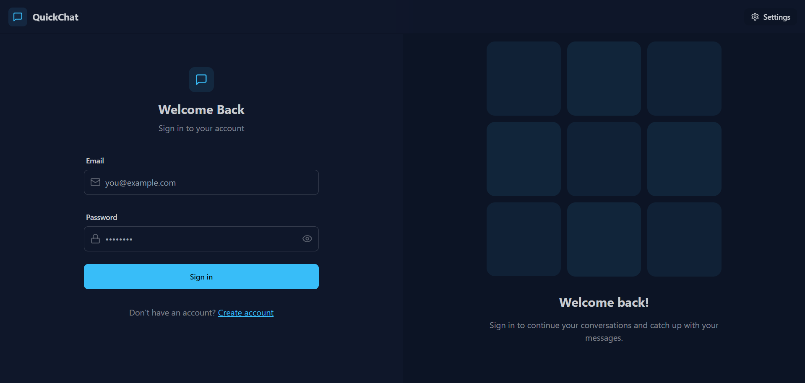

# 🚀 QuickChat -> A MERN Stack Real-Time Chat App

**Live Demo:** [https://quickchat-9dt1.onrender.com](https://quickchat-9dt1.onrender.com)

A feature-rich real-time chat application built with the MERN stack (MongoDB, Express, React, Node.js), Socket.io, Zustand, TailwindCSS & DaisyUI—supporting instant messaging, rich UI, and advanced personalization.

---

## 🌟 Overview

This chat application lets users sign up, log in, and exchange messages—both text and images—in real time. The intuitive interface offers user authentication, online user status, profile management, and customization with 32 built-in themes. Communication is instant thanks to Socket.io, and the entire app is styled responsively with TailwindCSS and DaisyUI for a polished modern look.

---

## 🛠️ Tech Stack

- **Frontend:** React, TailwindCSS, DaisyUI, Zustand
- **Backend:** Node.js, Express
- **Database:** MongoDB
- **Real-time Engine:** Socket.io
- **Authentication:** JWT tokens & secure cookies

---

## ✨ Features

- **Real-Time Messaging:** Instant chat powered by Socket.io, supporting text and image messages.
- **User Authentication:** Secure login/signup flow using JWT tokens—sessions managed in cookies for privacy.
- **Profile Management:** Update profile details and avatar directly from the settings page.
- **Online Status:** See which users are online in live time within your chat list.
- **Theme Selection:** Choose from 32 different themes for a personalized chat experience, all powered by DaisyUI.
- **Responsive UI:** Modern layouts with TailwindCSS and DaisyUI; fully mobile support and smooth theming.
- **Global State Management:** App state managed via Zustand for seamless experience.
- **Error Handling:** Robust error catching and helpful user feedback both client- and server-side.
- **Best Practices:** Organized codebase with clear separation for models, controllers, middlewares, and utilities.

---

## 📦 Installation & Setup

1. **Clone the repository:**

2. **Create environment variables:**
- Setup the following env variables in backend folder -> MONGODB_URI ,PORT ,JWT_SECRET ,CLOUDINARY_CLOUD_NAME ,CLOUDINARY_API_KEY ,CLOUDINARY_API_SECRET ,NODE_ENV

3. **Build the project:**
```npm run build```

4. **Start the application:**
```npm start```

That's it! Your app will be running and accessible in your browser.  

## 🖼️ Screenshots

Here are some screenshots showcasing the app's main features and user interfaces:

### Sign Up & Sign In Pages



### Home Page & Chat Window


### Profile & Theme Selection


